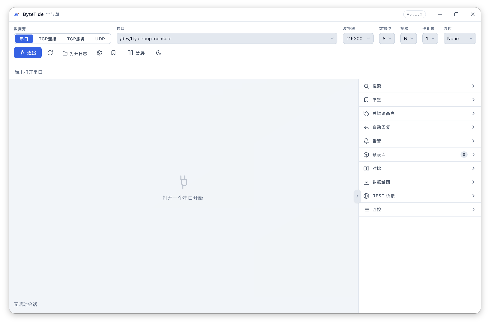
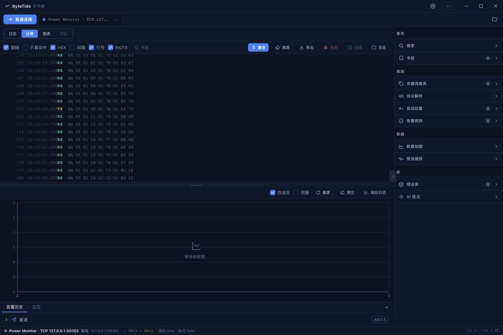

# ByteTide

[简体中文](./README.md) | [English](./README.en.md)

A **serial / network log debugging workbench** for embedded developers. Every line your device sends over a UART, TCP, or UDP connection can be viewed live, searched, plotted as a waveform — and handed to an AI assistant for protocol analysis with one switch.

> Why "ByteTide"? Device logs roll in like the tide — this is where you watch the waves and pick through what they wash up. Formerly known as Serial Tool.

Built with Tauri 2 + Vue 3 + Rust: small binaries, fast startup, low memory, fully offline — no cloud services involved.

## Preview

<p align="center">
  
  
</p>

---

## What can it do for you?

- **Debug sensors / modules**: your device keeps printing `V: 220, C: 10, P: 200`? Configure the frame format once and watch it as a live waveform — voltage and current trends at a glance.
- **Reverse a protocol**: device chatter you can't decode? Let an AI read your live logs through the built-in REST bridge and figure out headers, checksums, and field layouts for you.
- **Watch for trouble**: set an alert on keywords like `ERROR` or `ASSERT` and get a system notification the moment one shows up — no more staring at the screen during soak tests.
- **Compare two boards**: run the same flow on two devices, view them side by side aligned on the timeline, with behavioral differences highlighted in red.
- **Analyze after the fact**: logs are written to disk automatically. Reopen a `.log` file later as an offline session with every feature intact.

## Up and running in 3 minutes

1. **Install** (or download a release; building from source below):
   ```bash
   npm install
   npm run tauri build   # bundle in target/release/bundle/
   ```
2. **Connect**: pick a port (or a TCP / UDP address) in the top bar and hit Connect — logs start scrolling.
3. **Explore**: search for keywords; click a line and press `Ctrl+B` to bookmark it; open the Plot panel to see waveforms; flip on the REST bridge when you want an AI to take a look.

> No hardware at hand? The repo ships [sample-data/plot-demo.log](./sample-data/plot-demo.log) (600 frames, dual-channel sine waves) — load it via "Open Log" and try everything.

---

## Features at a glance

### Connections
- **Multiple transports**: serial (COM), TCP client / server, UDP listener — all with the same UX
- **Multiple tabs**: run several sessions at once; Split View shows 2–4 of them side by side
- **Connection control**: Stop (keep the log) / Reconnect (same config, carries over logs, searches, alerts) / Close
- **Offline sessions**: open a `.log` file and get every feature except send/receive (the AI bridge can read it too)
- Save port settings as **presets** and reapply with one click

### Reading logs
- Virtual scrolling with a buffer of the **last 50,000 lines**; very long lines scroll horizontally
- Toggle on demand: follow tail, matches only, HEX view, inter-line delta, line numbers, RX/TX column
- Live RX/TX byte counts and throughput at the bottom

### Finding things
- **Search**: keywords or regex; the hit list sits right under the search box — click to jump
- **Filter chain**: stack include/exclude stages — a visual `grep | grep -v`
- **Keyword highlights**: multiple keywords, each with its own color and live counter, independent from search

### Sending
- ASCII / HEX modes, `Ctrl+Enter` to send, optional newline
- **Scheduled repeat sending**; click history entries to refill the input

### Automation
- **Auto-reply**: send a response whenever matching input arrives — great for query/response protocols
- **Alerts**: system notifications (optional beep) on keyword/regex hits, with count windows and cooldowns; 100-entry history, click to jump back
- **Line bookmarks**: `Ctrl+F2` / `Ctrl+B`, managed from the sidebar
- **Config presets**: save filter chains / keywords / auto-replies / frame formats as named presets; import & export the whole library as JSON

### Monitoring
- **Live dashboard**: 60-second line-rate bars, byte-rate curve, inter-line gap min/avg/p95/max

### Session compare
- Pair two logs by timestamp within a tolerance: side-by-side rows, differences highlighted, over-tolerance deltas in red, click either side to jump

### Plotting
Slice the incoming byte stream into frames and plot multi-channel values in real time.

The frame format is fully configurable: header / trailer / checksum (none, sum, XOR) / channel count / bytes per channel (1/2/4) / endianness / signedness.

```
[HEADER][DATA: channels × bytesPerChannel][CHECKSUM?][TRAILER?]
```

Example: frame `01 00 01 02 12 43`, header `01 00`, 2 channels × 2 bytes, big-endian →
Ch0 = `0x0102` = **258**, Ch1 = `0x1243` = **4675**. Hover any point to see its arrival time, raw frame, and per-channel values.

Two data sources: compact binary frames (raw-byte mode), or hex *text* like `"01 00 12 43"` (ASCII-hex mode).

### REST analysis bridge (hand your logs to an AI)

The most interesting trick in here: flip on "REST Bridge" in the sidebar and the app starts a **local HTTP service** (token-authenticated). External tools — say, an AI CLI — can then read your live logs directly.

The workflow: enable the bridge → copy the URL + token shown in the panel to your AI → the AI can then:

- Page through logs, long-poll for new lines, filter by keyword / regex / hex bytes
- **Infer the frame format** (headers, checksums) automatically, then decode values and chart distributions
- Analyze traffic rhythm (histograms, p95 gaps, stalls)
- Read your **bookmarks and alert history** — what you flagged is what the AI looks at first
- Stream out the **complete on-disk history**, not just the in-memory window
- Once a protocol is confirmed, **write the discovered frame format back** into the Plot panel — you see it in the app instantly
- Optionally (off by default) send commands and await replies

A ready-made AI skill package lives at [skills/serial-tool-bridge](./skills/serial-tool-bridge) (standard SKILL.md format): copy that folder into your AI assistant's skills directory to install it — e.g. `~/.zcode/skills/` for ZCode users; Claude Code / Codex work the same way.

---

## CLI (`bytetide`): headless monitoring

Where the desktop app can't go — servers, Raspberry Pi / ARM boards — watch your serial line with the `bytetide` command-line binary. GitHub Releases under `cli-v*` tags ships **static musl builds** for aarch64 / x86_64: copy a single file over, run it, nothing to install. Build locally with `cargo build -p bytetide-cli --release`.

```bash
bytetide list                                  # list serial ports
bytetide monitor                               # no source arg: arrow-key port picker
bytetide monitor -p /dev/ttyUSB0 --baud 115200 --ts
bytetide monitor --tcp 192.168.1.50:9000 --retry 5
bytetide monitor --tcp-listen 9000 --json      # one JSON object per line, script-friendly
bytetide monitor --udp 5140
```

Interactive sending: type a line and press Enter to send it as ASCII; `/hex AA 01` sends hex, `/mode ascii|hex` switches modes, `/quit` exits.

```
$ bytetide monitor
? Select port › /dev/ttyUSB0 (USB Serial)
RX  [Boot] sensor-fw v2.1
TX  get temp           ← typed + Enter
RX  T=23.4C
TX  AA 01              ← /hex AA 01
^C
Disconnected: 00:03:12 · RX 1284 lines / 54.2 KB · TX 2 lines / 12 B · recorded log.tsv
```

Data lines go to stdout (`RX  ` green / `TX  ` amber, two-space columns); the connect banner and the Ctrl-C summary go to stderr — so `| head` and redirections are safe (exit codes 0/1/2). `--no-color` or `NO_COLOR` disables color. `-o/--record <path|template>` records a desktop-compatible TSV you can copy back and reopen via "Open Log" with every offline feature intact; by default nothing is recorded and no timestamps are shown. See `bytetide --help` for everything.

---

## Building

```bash
npm install

npm run tauri dev      # dev mode: desktop app with hot reload
npm run tauri build    # installer bundle in target/release/bundle/
npm run build          # frontend only: type-check + production build
npm test               # frontend unit tests (40+)
cargo test             # Rust unit tests (run at repo root: core / cli / src-tauri)
cargo run -p bytetide-cli -- --help   # try the CLI locally
```

Requirements: Node.js 18+, Rust stable, plus the [Tauri 2 system dependencies](https://tauri.app/start/prerequisites/).
The Rust side is a Cargo workspace (`crates/bytetide-core` / `crates/bytetide-cli` / `src-tauri`): run cargo commands from the repo root; the lockfile and build artifacts live in the root `target/`.
GitHub Actions runs the full check suite on push / PR.

> `npm run dev` alone (without the Tauri backend) still renders the UI for a smoke check — but serial I/O won't work.

---

## Project layout

```
serial_tool/
├─ crates/               # Cargo workspace members
│  ├─ bytetide-core/     # Core logic: serial / sessions / ring buffer / rules / recording (Tauri-free)
│  └─ bytetide-cli/      # The bytetide CLI (headless monitoring)
├─ src/                  # Frontend (Vue 3 + TypeScript + Pinia)
│  ├─ components/        # UI: log view, send panel, search, plot, sidebar panels
│  ├─ composables/       # Headless logic: events, parsers, plotting, alert beep…
│  ├─ stores/            # Session state machine, alert history
│  └─ types/             # Types & defaults (single source of truth)
├─ src-tauri/            # Desktop Rust shell: invoke commands, REST bridge, hotplug, event forwarding
├─ sample-data/          # Demo log
├─ docs/                 # Screenshots & docs assets
├─ skills/               # AI skill package for the REST bridge (copy to ~/.zcode/skills/)
└─ AGENTS.md             # Code conventions (read before hacking)
```

## Roadmap

1. **In-app AI analysis**: chat about a selected log excerpt right inside the app
2. **Send-command presets**: store common commands as one-click buttons
3. **Auto-append checksums** when sending (sum / XOR / CRC16)
4. **Plot interaction**: zoom, pan, dual cursors, CSV / PNG export
5. **Built-in protocol templates**: Modbus RTU and friends, one click away
6. **Timeline replay**: replay offline logs at original pacing as a pseudo-live session
7. Compare-view full diff; multi-client TCP server; UDP send-to-peer
8. Global shortcuts / command palette; port aliases

## License

MIT — see [LICENSE](./LICENSE).
